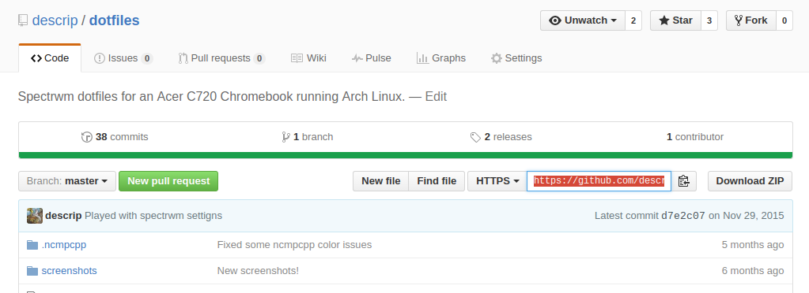

# Working with Git and Github

### 0) Before We Start:
1. What the heck am I doing?
	- Git is a program used for maintaining and syncing code in between multiple computers for software development. Formally, it’s a Version Control System (VCS), and, if you’re going to be hacking together a program with a group, you’re going to want to learn how to use Git. It's the industry standard for managing a group project.
	- GitHub is, like the name suggests, a hub for Git. It’s a website that allows free cloud hosting for your code using Git, as long as you’re willing to share that code with everyone else. It’s a great tool for students who are just looking to practice programming and don’t have the money to dish out to store their code online.
	- **TL;DR**: Use Git with GitHub to code with your friends easily, or if you just want to back it up somewhere on the Internet.
2. Register on GitHub. Click the green "Sign Up" button on the top right!
3. Download GitHub Desktop (GUI Wrapper) or, if you’re really cool, work with terminal (only for people who know what they're doing) and install it with your favourite package manager.
	- [GitHub Desktop Download](https://desktop.github.com/)
	- [Git (Terminal) for Windows](https://git-for-windows.github.io/)
	- [Git (Terminal) for OSX](https://code.google.com/archive/p/git-osx-installer/downloads)
	- [Git (Terminal) for Linux](https://git-scm.com/book/en/v2/Getting-Started-Installing-Git#Installing-on-Linux)

### 1) Create your first repository:
1. A repository (or repo for short) is the place that holds all of your code in Git.
2. Create a new repo online (GitHub):
	1.  Click "New Repository" under the plus sign on the top right. You'll be directed to here:

	

	2.  Enter a name and a description for the repository. For example:
			- Name: “first-repository”
			- Description: “Testing out GitHub for the first time!”
		
		Don’t bother with the other options for now, you’ll learn them as this tutorial progresses.
	3. Press the big green button to create the repository. Congrats! Now you've got a place to save your code.
3. Create the repo locally (Git):
	- Terminal Users:
		1. Call `git init` in the directory that you want to set up the repository in. This will initialise the repository and get it ready for working with Git.
		2. Now tell Git about GitHub's new repo. Go to your repo page and copy the link highlighted in orange:
	
		

		3. 
		

