# Working with Git and GitHub

Have you ever thought about programming on a team? How will you all work on the same code without messing each other up? How will you keep the same code updated amongst everyone on the team?

Git was invented for this purpose. It's a program that controls your code, especially for working in a team. GitHub is a website (the one that you're on right now) which gives free hosting space for code projects that use git -- provided that you're okay with other people seeing your code.

If you plan to do any coding with your friends or coworkers, in the industry or just for fun, you'll probably end up using git. So it's pretty important that you learn to use it.

This workshop is not meant to be a thorough course to git and GitHub. Instead, this will teach you just what you need to know about the two to be able to work in a group effectively in the course of just an hour.

## Section 0: Prerequisites

1. You're going to need a GitHub account. Register one by pressing the big green "Sign Up" on the top right. 
2. Get yourself a copy of git on your computer. You've got two choices:
	- Regular Git: Requires knowledge of the command line. If you're comfortable with a terminal, we'd definitely recommend this one. If you've got a package manager, you're welcome to get git from there.
		- [Download Git for Windows](https://git-for-windows.github.io/)
		- [Download Git for OSX](https://code.google.com/archive/p/git-osx-installer/downloads)
		- [Download Git for Linux](https://git-scm.com/book/en/v2/Getting-Started-Installing-Git)
	- GitHub Desktop: A friendly GUI version for those who don't know how to use a command line.
		- [Download GitHub Desktop for Windows/OSX](https://desktop.github.com/)
		- Linux not supported, sorry. If you're a Linux user, chances are you're downloading regular command line git right now.

## Section 1: Making a Repository

A **repository**, or repo for short, is the space where your code project goes. It doesn't have to be just code -- it could be word documents, images, whatever you'd like in your code project! All of your friends will be working on this one repository.

We're going back to a classic for this one: Hello World! But first, a note: you're technically going to have two repositories: a local one on your computer, managed with git, and the online one, managed with GitHub. Don't concern yourself with specifics right now, let's get to work.

### Creating a Repository on GitHub

Let's get the online repository up and running first. Head over to your web browser and get on GitHub.

1. In the upper right corner, next to your username, click the **+** and then click **New repository**.
2. Name your repository `hello-world`.
3. Write a short description, if you'd like.
4. Select **Initialize this repository with a README**.
5. You're ready! Click the big green `Create repository` button.

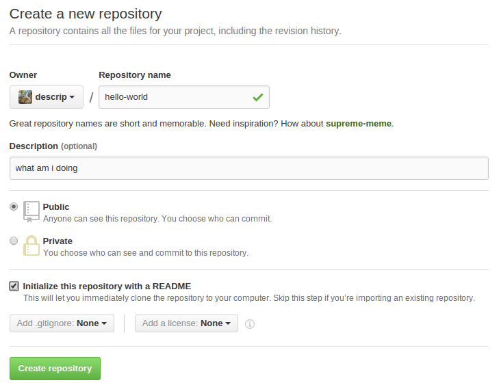

### Creating a Repository on Git

Now you're going to have to make a local repo on your computer, and this one will be handled by git.

- Terminal Users:
	1. Navigate or create a directory that you'd like to keep your `hello-world` project in. While within the directory, call `git init`. This command will automagically set up the directory for use with git.
	2. Now tell git that the GitHub repo exists. Back at GitHub, make your way to the `hello-world` repo page, and copy the link that's given in the top toolbar. This is a link to this GitHub repo. I've selected the link in orange for you so you can find it quickly.
		
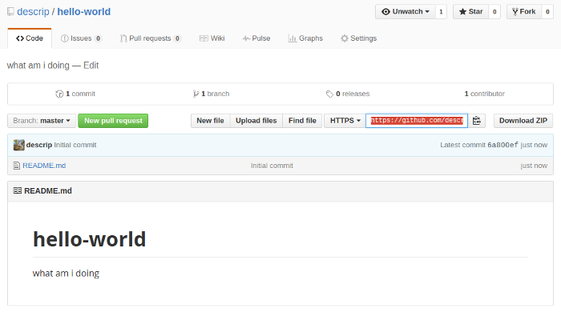

	3. Back in the terminal, call the command `git remote add origin <link to repo>`. This tells the local git repo about the online GitHub repository.
	4. Now let's get the two repositories in sync. The online repo has a `README.md` file. Clone it on the local repo by calling `git pull origin master`. Don't bother with `origin` or `master` for now.
- Desktop Users:
	1. Unlike terminal users, you don't need to make a local repo. GitHub Desktop does it automatically for you. First you have to sign in.
		i. In the upper right hand corner of the program, click the  icon and go to "Options":
			
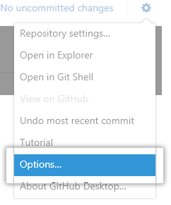

		ii. Go to **Accounts** and click **Add account**.
		iii. Under **Log in** fill in your username and password for GitHub and click **Log in**.
	2. Now that you're logged in, click the encircled **+** icon in the top right. This will open a menu that will allow to "Add" a pre-existing local repository, "Create" a completely new repostory, or "Clone" a repository that you have on github.com.
		
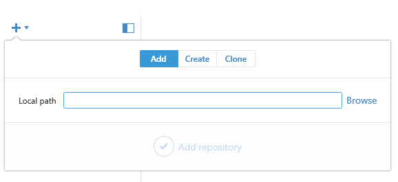

	3. We want to "Clone" the repo we made on github, so navigate to the "Clone" tab. A list of all your github.com repos will show up. From there, select your `hello-world` repo.
	4. Click the check mark at the bottom. This will bring up a dialog box asking where to put the repository. Choose the directory you want to put it, then press "Ok". The window should now look like this:
		
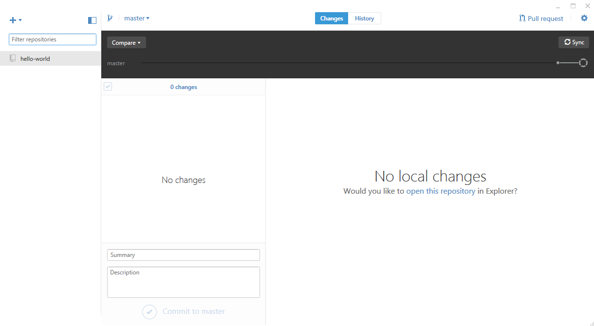

        
### Why do we have two repositories?

Remember: Git and GitHub are two different programs. There will be a central official repository online, hosted by GitHub. However, you should perform the changes that you want to make on the project on your local git repository, and then tell git to make those same changes on the official GitHub repo.

This might seem tedious if you're working alone, but think about what happens in a team. It would be pretty chaotic if everyone made their own direct changes on the official online repository. If everyone had their own little local version of the official repository, they could use git to keep changes constant between everyone's local repositories and the official online repo.

If you're using the command line, this is where `origin` and `master` make sense. `origin` is the official online GitHub repo. `master` is the local git repo. When you called `git pull origin master`, you told git to pull all of the stuff that was at `origin` over to `master`.

### Something to notice: README's are actually read.

GitHub repos search for a file called `README.whatever` and display it on the repo web page. This way, `README`'s are actually read and not absolutely ignored.

When you were creating your `hello-world` repo, you opted for a `README` to be created for you. If you look at your webpage right now, you can see it in action as a giant box under the list of files in your repo, along with the description that you gave to the repo.

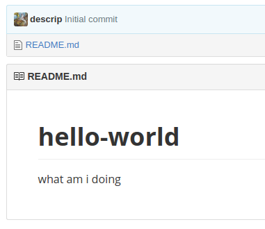

GitHub also supports Markdown editing with `README`'s. Normally, the filename is `README.md`. If you don't know what Markdown is, don't worry. Just treat the `README` as a regular text file.

## Section 2: Add, Commit, Push.

Say you make a change to your local repo. Open up your favourite text editor (bonus points if it's Vim) and create a new text file in the repo. It can be anything you want, and you can put whatever you'd like in it.

This new file is going to represent a change to your code project. Now, lets get this change from your local git repo to the online official GitHub repo.

### Adding a File:

Git doesn't recognise new files unless you want it to. First, you'll need to tell Git that the file has been changed.

**Terminal users**: Use the command `git add` to add the file. There are lots of options to choose from:
	- `git add <filename>`: Adds the given file and nothing else.
	- `git add *`: Adds all the files in the current directory.
	- `git add .`: Adds all the files in the current directory recursively. That means that, for a folder that is sitting within your directory, all the files and folders within that folder will be added too.

**Desktop users**:  GitHub Desktop makes your job much easier by automatically detecting which files have been changed or added and providing you a graphical interface for chooising which ones you want to keep:

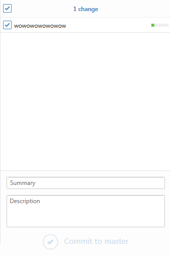

Pressing the  next to a file will change whether or not git will include the changes when you go to *commit* (later on). You can even click on the file to show you what changes were made:

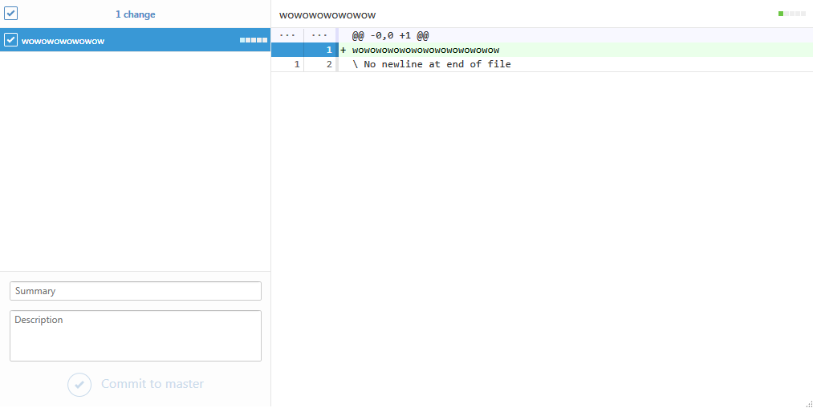

### Committing a Change

Now you're going to have to tell Git that you'd like to officially record the changes in the repo. Whenever we tell git about the changes we've made to the project, we call it a commit. **You can add multiple changes in multiple files in just one commit** -- for example, I can create a hundred files in the directory and call a single commit. Git will figure it all out and list those hundred files as one change to the repo.

**Terminators**: committing is one simple command that you can run wherever in the directory. Call `git commit -m "<message>"`, where `<message>` is something to describe the changes that you've made in this change to the project. Trust me, you're going to want to describe your commits well.

**Desktopians**: In the main window, once you've chosen which files you want to include in the commit by checkmarking them in the list above, go to the lower panel and add a description and a summary, then press "Commit to master".

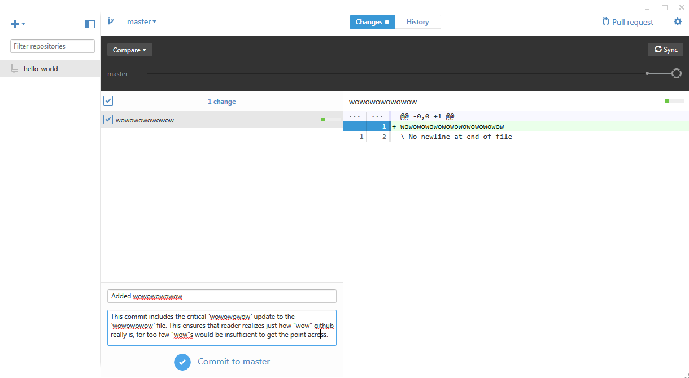

### PUSH!

Now we're going to make the changes that you've made to your local git repo official, by pushing them to the official online GitHub repo. Under the hood, git tells GitHub about all of the commits that you've made on your local repo, and GitHub makes the same commits on the official repository. Even though you're pushing only one commit for now, keep in mind that **you can commit multiple times before a push**, and all of those commits will make it to the GitHub repo.

**Termies**, make the call `git push origin master`. From before, you should interpret this command as pushing everything at `master`, the local git repo, to `origin`, the online official GitHub repo. You'll have to provide your GitHub username and password for security.

**Deskies**, pushing is really easy for GitHub Desktop. Just press the `Sync` button in the top-left corner of the "History" tab. It looks like this:

It should be noted that this doesn't just *push* your changes to GitHub, it also *pulls*. *Pulling* is the reverse of push: it takes whatever changes are on the GitHub repo and applies them to your local repo. This is useful when someone else makes changes to your repo on GitHub that you don't have, but more on that in a later section.

### Wowow, it's in the cloud!

Now, if you navigate back to the GitHub repo webpage, you'll be able to see the new file that you created, or any changes that you made to existing files. Congratulations!  :tada:  You've just made your first `add`, `commit`, and `push`!

## Section 3: Rolling back the Repository to a Previous Commit

In hindsight, we've made some mistakes. `important-change.txt` was a permanent blemish on my career, and I'm sure whatever change that you've made to your repos were similarly deserving of regret. Let's reset the repo, to an earlier, more pristine time.

### Open the Commit History

Head to the GitHub page for your repo and click on the left most entry to the top bar, the button that says `X commits`. You'll end up with the commit list, a page that has entries like these:

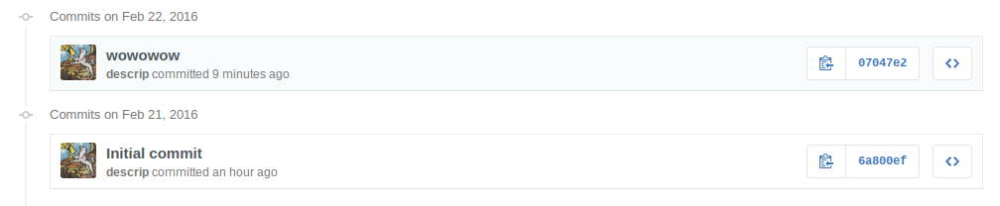

It should be just two commits: the initial commit that was made when you created the repo, and the commit that you made when you made a change back in Section 2.

Each entry contains information on the user that made the commit, the message that was given for the commit, the time it was made, and some weird mish-mash of letters and numbers on the right. That mish-mash is what's known as a commit id, a string that uniquely identifies this certain commit. It's actually a small prefix of an SHA hash and, if you click on the clipboard to the left, you can get the full hash that identifies this commit. For me, `0747e2` was actually `07047e2b04c85b9fe3609f7b91558732e3c663ed`.

### Reverting to a Better Time

The commit where I added `important-change.txt` had an id of `07047e2`. Let's undo that mistake. Copy the shortened id of the commit that you want to move back to. In this case, it's the very first commit: `6a800ef`.

**Terminal users**, call the command `git reset --hard <commit id>`. Afterwards, call `git push -f origin master`. The `-f` tag tells `git push` to forcibly push it. Git is smart: it realises that the current state of the repo is the same as one of a previous commit, and won't push to be efficient.

**Desktop users**, you have two options. Right after you commit, you can press "Undo" in the bottom-left corner of the window right after you commit:

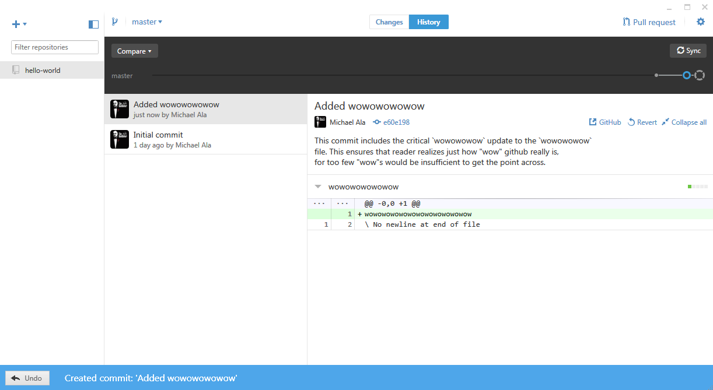

or you can press the `revert` button on the commit page:

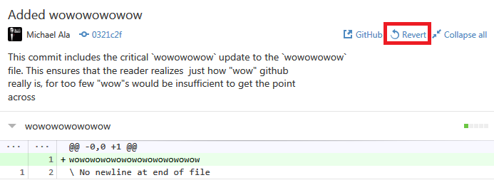

Both ways do the same thing.

Now go back to the official GitHub repo page and refresh. Look at the commit history now. The last commit you made is all gone. In practice, all of the commits between the last commit to the repo and the commit that you reverted back to will be **irreversibly erased**. You cannot revert this action.

It's too bad real life isn't this easy to revert.

### This is not the only way

Actually, in my opinion, it's a pretty bad way to do it. If this workshop had more time, I would be teaching you `git checkout` or `git reset --soft`. However, both commands require knowledge of branches or commit trees, something that overall isn't that important to using git. If you have some time, I'd definitely recommend learning more into it. Just Google.

## Section 4: Collaboration!

The whole point of git and GitHub is being able to collaborate on a project with some teammates. Now you know how to work the two alone, it's time to learn how to work with friends -- or, more specifically, collaborators.

At this point in time, I'm going to ask you guys to split into pairs in order to simulate working teams. If you're reading this alone, grab a friend or pretend you have one.

### Adding a Collaborator

On your GitHub repo page, head over to `Settings`. You might have to type in your password at this point. Afterwards, on the left hand panel, click `Collaborators`. You'll end up at a page like this:

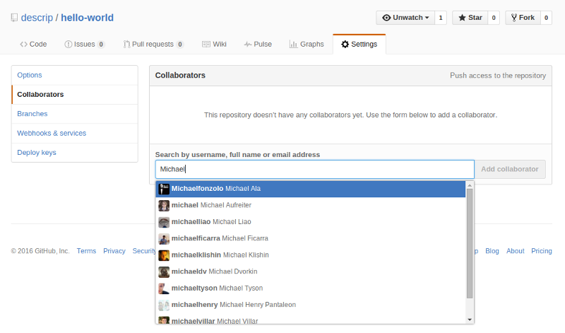

This is where you can add collaborators to a repo. A collaborator is a GitHub user that has read and write permissions on your repo -- that is, he or she is able to push their own changes to your repo. As such, they have complete control what goes on it. Go ahead and add your friend as a collaborator onto your account.

Now, have the other user perform the steps shown some sections ago. Create a local repo 

Any collaborator can now add, commit, and push freely to the repo as much as he or she wishes!

### Conflicts
