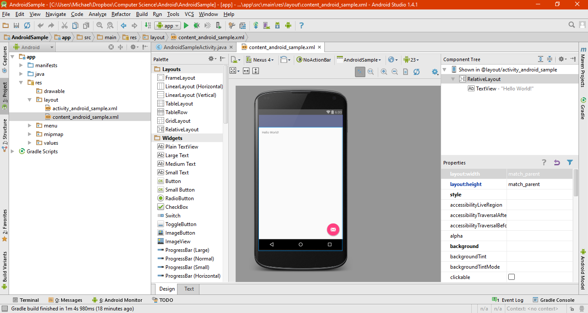
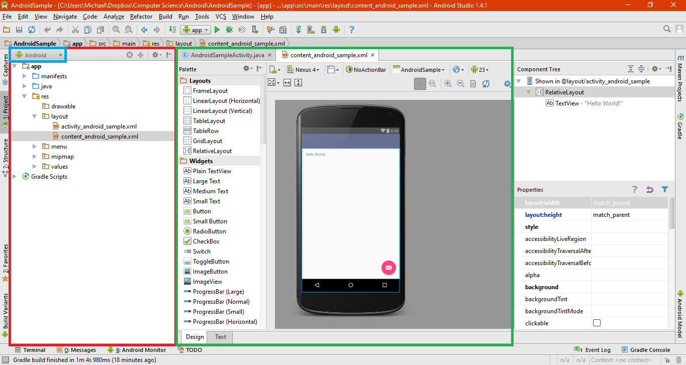
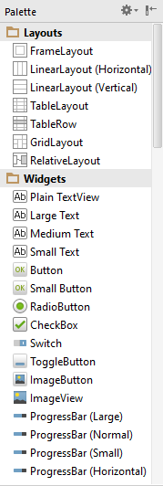
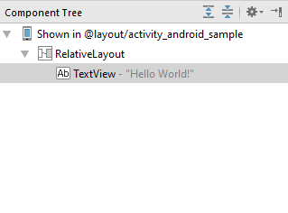
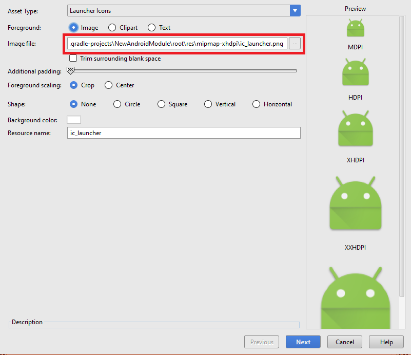
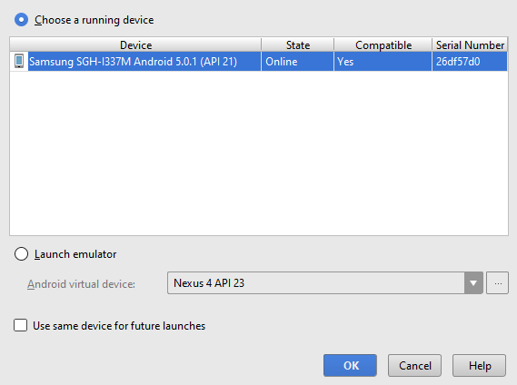
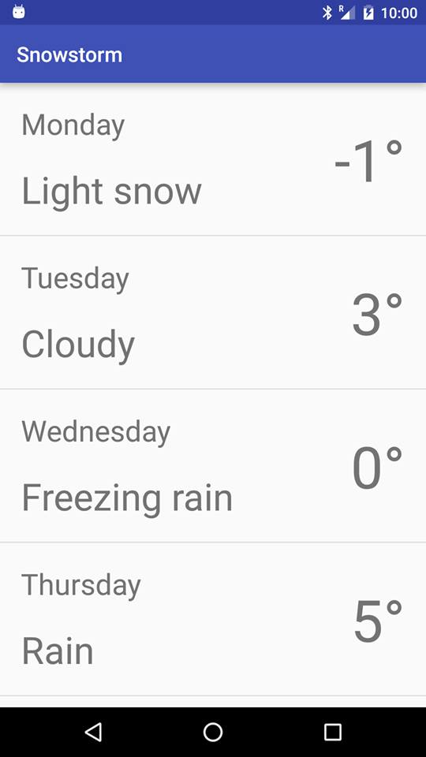

# Intro to Android

## What the heck is Android?

_Estimated Time_: 1-2 min

Just like how Windows and Mac OS X and Linux are operating systems for your computer, _Android_ is an operating system for mobile devices. It allows you to do everything you do on your computer from your phone, including surfing the web, watching videos, playing games, etc. Furthermore, just like how you have apps on your computer, you have apps on Android, which are just programs that use the _Android API_ to interact with your phone.

Apps for Android are written in Java.

Android Studio is the IDE (Integrated Development Environment) that allows you to make apps really easily, just like how Visual Studio allows you to write other programs more easily.

## Creating a Project

This workshop will cover the creation of a weather app. For the first hour we will be using fake data, and during the extra time we'll add support for real data retrieved from the internet.

1. Open Android Studio

2. In the Setup Wizard, click `Start a new Android Studio Project` to open the New Project Wizard.

    i. Set the `Application Name` field to something like `My Weather App` or `Snowstorm`. This is not just the name that will be used to refer to the app in Android Studio, but will also be the name of the app once we get it onto your phones.
    
    ii. The `Package Name` is just a unique identifier for your app in the Google Play Store. The general naming convention is the reverse of your company's domain name, followed by the name of the application. For example, if your company domain is `www.mycompany.com` and the application has been named `AndroidSample`, then the package name might be `com.mycompany.androidsample`. In this case a good name might be `com.(yourname).snowstorm`
    
    If you don't own a domain name, don't worry about it. As said prior, this is just some unique identifier name specific to your app. The important thing is not that it refers to an actual domain, simply that it is _unique_. The easiest thing to do is to just use the default
    `Company Domain` given, which will be something like `<name>.example.com`.
    
    iii. The `Project Location` is simply where the project will be stored.
    
3. Click `Next` when you've filled out the necessary info. This will bring you to the _Form Factors_ screen.

    i. Make sure `Phone and Tablet` is checked. This will indicate that your app is intended for phones and tablets. The other options, `Wear`, `TV`, and `Android Auto`, refer to wearable devices (such as Google Glass), Google TV, and automobile dashboards respectively. Leave these unchecked.
    
    ii. Select `API 16: Android 4.1 (Jelly Bean)` as the `Minimum SDK` setting. This ensures that your app will run on most devices. The older the version selected, the wider the range of devices your app will run on. If we selected `API 23: Android 6.0 (Marshmallow)`, your app would only run on a small percentage of all devices (< 1% as indicated).
    
4. Click `Next`. This will bring you to the *Add an activity to Mobile* screen. For the purposes of this tutorial, simply select `Empty Activity`.

5. In the following dialog you can leave all the fields the way they are. These fields represent the name of the initial activity you'll be working in.

6. Click `Finish`. It may take a few minutes for the project to build, and once the Android Studio window is loaded, give it a few minutes to load everything (as there is a LOT it has to load).

### What's an Activity?

An `Activity` is a component of your application that your user can interact with. Activities usually take care of creating a window in which you can add your UI. For example, you should be able to see that there's a `Empty Activity`, which is just an empty window, a `Google Maps Activity` which is the base activity for Google Maps based applications, and there's a whole bunch of other things.

*Note*: Some activities require higher versions of the SDK than 8.

You can have multiple activities simultaneously, but there's usually only one that the user interacts with (typically the "main" activity). Activities can create other activities to perform different actions.

## Inside Android Studio

It's easy to get overwhelmed by the amount of content available at first glance, but don't worry, as we'll focus our attention to only a few key areas, and the rest is just extra stuff necessary for our app to work you can learn about later. Android Studio is an incredibly powerful tool that gives us a lot of control over how our app looks and functions, and provides a large tool belt of gadgets that make designing apps really easy. It's just a matter of learning.

Upon initially loading, your Android Studio Window will look something like this:

The leftmost rectangle is the *Project* tool window (highlighted in red below), which displays the files and folders associated with your project. The _window mode_ (highlighted in blue) determines the mode in which the information is displayed. By default it's set to _Android_, which displays only the essential files and folders. Another common mode is _Project_ which lists _all_ files and folders associated with your project. Check out the other modes too!

The central *Designer window* (green) shows us whatever we're currently working on. This could be a java file or an xml file or a graphical display. Right now it's giving us a preview of what our app will look like. Specifically, it's showing us our *empty activity*. As you can see, right now our app will simply be a blank window with the text "Hello World!" displayed in the top left corner. Currently in your editor, you should have the file `content_android_sample.xml` open. If not, you can locate it in the Project window under `app/res/layout`. 

In the left of the designer window is a panel called the *palette* (pictured below), which contains a bunch of user interface _components_ that we can add to our activity to make our app look the way we want it to. You should recognize some of these components, such as `Large Text` and `Button` as these are pretty common things to include in a user interface.

Not all components are things that the user can clearly see like text and buttons, that's why the palette is divided up into _widgets_ and _layouts_. Layouts define the visual structure for your activity, whereas widgets are things with _function_ that can be placed in your activity.

If you go over to the side panel on the right of the designer window, you can see the _Component Tree_ for your activity (pictured below). This represents the hierarchy of components in your activity. As we can see, our activity consists of a `RelativeLayout`, which contains a single `TextView` object whose text is set to "Hello World!".

### What's a `RelativeLayout`?

In Android, a `RelativeLayout` is a layout in which the positions of the things inside it can be specified as relative to _other_ things. For example, this allows you to say things like "button 2 to the right of button 1" and Android will figure out the rest.

### Adding an Icon

Let's give our app an icon, so that when we load it onto our phone we can easily recognize it. The easiest way to do this is as follows:

i. Right click on the `app` folder in the project panel and select `New -> Image Asset`.

ii. In the resulting dialog box, on the line highlighted below locate the directory of the snowman icon you downloaded. You don't have to change anything else.

iii. Click "Next" and then "Finish". Your icon should now be set to the snowman.

### Building and Launching

Building your app really easy, just go to `Build -> Make Project`. This will compile all your code and assets so that it can then be loaded onto your phone.

Assuming your phone is plugged in via USB cable, you can run your app just as easily by pressing the green arrow icon () at the top. You'll be brought to a dialog box listing what devices you can run your app on, your device being the one at the top:

Select it and press "OK". After a short period the app should show up on your phone.

Impressed yet? Let's start building...

## The Anatomy of an Android App

Every android app can be pretty easily divided up into two distinct parts; the Xml part, and the Java part. The Xml part defines things like the user interface and the layout of the app, whereas the Java part defines the *functionality* of the app. Both parts have to work in tandem for an app to be successful. 

For the purposes of this workshop, we'll write the two parts separately, then near the end we'll combine them to form functioning app.

### Making the UI for our app

Eventually we want our app to look something like this:

To get started, we have to take a look at our *layout file*.

The layout file is an Xml file named something like `activity_main.xml` (it should be the default file opened). When you open it you'll get a preview of what your app will look like. You may notice in the bottom left corner of the designer window there are two tabs, one labelled `Text` and the other labelled `Design`. If you switch to `Design` you'll be brought to the underlying Xml file in text format. This is actually how the layout information is stored in memory. We don't need to touch this for now, it's just nice to know it exists.

First thing we're going to do is actually make a new layout file. Right click `layout` in the Project View and select `New -> Layout resource file`. For the name use `view_day_forecast`. Change the root element to `RelativeLayout` and press "OK". This will bring you to another designer window. In this window, we'll design what the UI for a *single day* will look like (a single row in the above image).

### Adding some text

We should start by adding some text for the day name. Click and drag a `Large TextView` from the `Palette` and drop it into the designer window. You'll see a bunch of lines pop up; these are *guides* showing you where you can snap the placement of your text to. Snap it to the top left corner.

We can double click on the text *widget* to change the text it displays. Change it to `Monday` for now, and change the `id` to `tvDay`. The *id* of a widget is kind of like the variable name we're gonna use to refer to the widget later in the code. Just think of it like a variable name.

If you go to the panel in the bottom right corner of Android Studio called `Properties`, you can edit a bunch of the properties of the widget. If you scroll through you can find all sorts of things, but there's three specific ones we want to change:

i. `textSize` - we want this to be `28sp`. This controls the size of the font.
ii. `layout_marginTop` - change this to `20dp`. This controls how far from the top of the screen the text will be placed.
iii. `layout_marginLeft` - change this to `20dp`. This controls how far from the left of the screen the text will be placed.

Now we're going to do the same thing for the *weather type* of that day. Click and drag another `Large TextView` widget and place it directly underneath the first textview, and change it's text to `Light snow` and it's id to `tvWeather`. Change it's `textSize` to `36sp`, it's `layout_marginBottom` to `20dp`, and its `layout_marginLeft` to `20dp`. Since we're going to be using this layout as a single element in a list, the `layout_marginBottom` will determine the *next element* in the list.

Really what these `layout_margin` properties are specifying is the distance from the surrounding objects.

We're going to do this one more time for the temperature: place a `Large TextView` this time so that it snaps to the right of the screen. Change the text to `-1`, the id to `tvDegrees`, and the `textSize` to `56sp`. Now set `layout_centerVertical` to `true` and `layout_margin` to `20dp`. `layout_centerVertical` ensures that the widget is centered vertically on the display, and `layout_margin` acts as a margin in all directions.

### What are all those dp, sp, px, etc?

These are different *units* that the Android SDK recognizes. They represent the following amounts respectively:

1. `px`: Pixels - corresponds to actual pixels on the screen.
2. `in`: Inches - based on the physical size of the screen. 1 Inch = 2.54 centimeters
3. `mm`: Millimeters - based on the physical size of the screen.
4. `pt`: Points - 1/72 of an inch based on the physical size of the screen.
5. `dp` or `dip`: Density-independent Pixels - an abstract unit that is based on the physical density of the screen. These units are relative to a 160 dpi screen, so one dp is one pixel on a 160 dpi screen. The ratio of dp-to-pixel will change with the screen density, but not necessarily in direct proportion. Note: The compiler accepts both "dip" and "dp", though "dp" is more consistent with "sp".
6. `sp`: Scale-independent Pixels - this is like the dp unit, but it is also scaled by the user's font size preference. It is recommend you use this unit when specifying font sizes, so they will be adjusted for both the screen density and user's preference.

### Making the list

Now that we have the basic format for a single day setup, lets return to the main file and setup the UI for an entire list of items. Go back to `activity_main.xml`. If you haven't already removed the `TextView` already there, you can go ahead and do so. We're going to add a `ListView` to our main activity. Go ahead and click and drag `ListView` from the palette into the designer until it aligns with the top-left corner of the window. Double click it in the designer window to change it's `id` to `lvWeather`.

#### What is a `ListView`

A `ListView` is a `ViewGroup` that allows you to display a list of other `View`s that the user can scroll through.

### What's this talk of `View`s?

`View`s are simply objects that can be displayed by Android. Any UI you make is going to be made up of `View`s in some form; a `TextView` is a `View`, a `Button` is a `View`, even layouts are a form of `View` called a `ViewGroup` which is comprised of multiple other `View` objects. In this sense, layouts are also all `ViewGroup`s.

---

This is all we can do for now regarding the UI. Let's start fleshing out the Java code now, and by the end we'll be able to combine these two pieces to form a fully functioning app.

