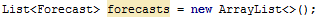

# Table of Contents

i. [Intro to Android](#intro-to-android)
    i. [What the heck is Android?](#what-the-heck-is-android)
    ii. [Creating a Project](#creating-a-project)
        i. [What's an Activity?](#whats-an-activity)
    iii. [Inside Android Studio](#inside-android-studio)
        i. [What's a `RelativeLayout`?](#whats-a-relativelayout)
        ii. [Adding an Icon](#adding-an-icon)
        iii. [Building and Launching](#building-and-launching)
    iv. [The Anatomy of an Android App](#the-anatomy-of-an-android-app)
        i. [Making the UI for our app](#making-the-ui-for-our-app)
        ii. [Adding some text](#adding-some-text)
        iii. [What are all those dp, sp, px, etc?](#what-are-all-those-dp-sp-px-etc)
        iv. [Making the list](#making-the-list)
            i. [What is a `ListView`?](#what-is-a-listview)
        v. [What's this talk of `View`s?](#whats-this-talk-of-views)
ii. [Diving into the Java side of things](#diving-into-the-java-side-of-things)
    i. [The `Forecast` Class](#the-forecast-class)
    ii. [What is an Adapter?](#what-is-an-adapter)
    iii. [What is a `Context`?](#what-is-a-context)
    iv. [What is `LayoutInflater`?](#what-is-layoutinflater)
    v. [We're done! Right?](#were-done-right)
        i. [Populating the `ListView`](#populating-the-listview)
iii. [Extra Help](#extra-help)
    i. [Enabling ADB on Android 5.0 Based Devices](#enabling-adb-on-android-50-based-devices)
        i. [Windows ADB Configuration](#windows-adb-configuration)
        ii. [Mac OS X ADB Configuration](#mac-os-x-adb-configuration)
        iii. [Linux ADB Configuration](#linux-adb-configuration)
        iv. [Testing the ADB Connection](#testing-the-adb-connection)

# Intro to Android

## What the heck is Android?

_Estimated Time_: 1-2 min

Just like how Windows and Mac OS X and Linux are operating systems for your computer, _Android_ is an operating system for mobile devices. It allows you to do everything you do on your computer from your phone, including surfing the web, watching videos, playing games, etc. Furthermore, just like how you have apps on your computer, you have apps on Android, which are just programs that use the _Android API_ to interact with your phone.

Apps for Android are written in Java.

Android Studio is the IDE (Integrated Development Environment) that allows you to make apps really easily, just like how Visual Studio allows you to write other programs more easily.

## Creating a Project

This workshop will cover the creation of a weather app. For the first hour we will be using fake data, and during the extra time we'll add support for real data retrieved from the internet.

1. Open Android Studio

2. In the Setup Wizard, click `Start a new Android Studio Project` to open the New Project Wizard.

    i. Set the `Application Name` field to something like `My Weather App` or `Snowstorm`. This is not just the name that will be used to refer to the app in Android Studio, but will also be the name of the app once we get it onto your phones.
    
    ii. The `Package Name` is just a unique identifier for your app in the Google Play Store. The general naming convention is the reverse of your company's domain name, followed by the name of the application. For example, if your company domain is `www.mycompany.com` and the application has been named `AndroidSample`, then the package name might be `com.mycompany.androidsample`. In this case a good name might be `com.(yourname).snowstorm`
    
    If you don't own a domain name, don't worry about it. As said prior, this is just some unique identifier name specific to your app. The important thing is not that it refers to an actual domain, simply that it is _unique_. The easiest thing to do is to just use the default
    `Company Domain` given, which will be something like `<name>.example.com`.
    
    iii. The `Project Location` is simply where the project will be stored.
    
3. Click `Next` when you've filled out the necessary info. This will bring you to the _Form Factors_ screen.

    i. Make sure `Phone and Tablet` is checked. This will indicate that your app is intended for phones and tablets. The other options, `Wear`, `TV`, and `Android Auto`, refer to wearable devices (such as Google Glass), Google TV, and automobile dashboards respectively. Leave these unchecked.
    
    ii. Select `API 16: Android 4.1 (Jelly Bean)` as the `Minimum SDK` setting. This ensures that your app will run on most devices. The older the version selected, the wider the range of devices your app will run on. If we selected `API 23: Android 6.0 (Marshmallow)`, your app would only run on a small percentage of all devices (< 1% as indicated).
    
4. Click `Next`. This will bring you to the *Add an activity to Mobile* screen. For the purposes of this tutorial, simply select `Empty Activity`.

5. In the following dialog you can leave all the fields the way they are. These fields represent the name of the initial activity you'll be working in.

6. Click `Finish`. It may take a few minutes for the project to build, and once the Android Studio window is loaded, give it a few minutes to load everything (as there is a LOT it has to load).

### What's an Activity?

An `Activity` is a component of your application that your user can interact with. Activities usually take care of creating a window in which you can add your UI. For example, you should be able to see that there's an `Empty Activity`, which is just an empty window, a `Google Maps Activity` which is the base activity for Google Maps based applications, and there's a whole bunch of other things.

*Note*: Some activities require higher versions of the SDK than 8.

You can have multiple activities simultaneously, but there's usually only one that the user interacts with (typically the "main" activity). Activities can create other activities to perform different actions.

## Inside Android Studio

It's easy to get overwhelmed by the amount of content available at first glance, but don't worry, as we'll focus our attention to only a few key areas, and the rest is just extra stuff necessary for our app to work you can learn about later. Android Studio is an incredibly powerful tool that gives us a lot of control over how our app looks and functions, and provides a large tool belt of gadgets that make designing apps really easy. It's just a matter of learning.

Upon initially loading, your Android Studio Window will look something like this:

<p align="center"></p>

The leftmost rectangle is the *Project* tool window (highlighted in red below), which displays the files and folders associated with your project. The _window mode_ (highlighted in blue) determines the mode in which the information is displayed. By default it's set to _Android_, which displays only the essential files and folders. Another common mode is _Project_ which lists _all_ files and folders associated with your project. Check out the other modes too!

<p align="center"></p>

The central *Designer window* (green) shows us whatever we're currently working on. This could be a java file or an xml file or a graphical display. Right now it's giving us a preview of what our app will look like. Specifically, it's showing us our *empty activity*. As you can see, right now our app will simply be a blank window with the text "Hello World!" displayed in the top left corner. Currently in your editor, you should have the file `content_android_sample.xml` open. If not, you can locate it in the Project window under `app/res/layout`. 

In the left of the designer window is a panel called the *palette* (pictured below), which contains a bunch of user interface _components_ that we can add to our activity to make our app look the way we want it to. You should recognize some of these components, such as `Large Text` and `Button` as these are pretty common things to include in a user interface.

<p align="center"></p>

Not all components are things that the user can clearly see like text and buttons, that's why the palette is divided up into _widgets_ and _layouts_. Layouts define the visual structure for your activity, whereas widgets are things with _function_ that can be placed in your activity.

If you go over to the side panel on the right of the designer window, you can see the _Component Tree_ for your activity (pictured below). This represents the hierarchy of components in your activity. As we can see, our activity consists of a `RelativeLayout`, which contains a single `TextView` object whose text is set to "Hello World!".

<p align="center"></p>

### What's a `RelativeLayout`?

In Android, a `RelativeLayout` is a layout in which the positions of the things inside it can be specified as being relative to *other* things. For example, this allows you to say things like "button 2 to the right of button 1" and Android will figure out the rest.

### Adding an Icon

Let's give our app an icon, so that when we load it onto our phone we can easily recognize it. The easiest way to do this is as follows:

i. Right click on the `app` folder in the project panel and select `New -> Image Asset`.

ii. In the resulting dialog box, on the line highlighted below locate the directory of the snowman icon you downloaded. You don't have to change anything else.

<p align="center"></p>

iii. Click "Next" and then "Finish". Your icon should now be set to the snowman.

### Building and Launching

Building your app really easy, just go to `Build -> Make Project`. This will compile all your code and assets so that it can then be loaded onto your phone.

Assuming your phone is plugged in via USB cable, you can run your app just as easily by pressing the green arrow icon () at the top. You'll be brought to a dialog box listing what devices you can run your app on, your device being the one at the top:

<p align="center"></p>

Select it and press "OK". After a short period the app should show up on your phone.

Impressed yet? Let's start building...

## The Anatomy of an Android App

Every android app can be pretty easily divided up into two distinct parts; the Xml part, and the Java part. The Xml part defines things like the user interface and the layout of the app, whereas the Java part defines the *functionality* of the app. Both parts have to work in tandem for an app to be successful. 

For the purposes of this workshop, we'll write the two parts separately, then near the end we'll combine them to form functioning app.

### Making the UI for our app

Eventually we want our app to look something like this:

<p align="center"></p>

To get started, we have to take a look at our *layout file*.

The layout file is an Xml file named something like `activity_main.xml` (it should be the default file opened). When you open it you'll get a preview of what your app will look like. You may notice in the bottom left corner of the designer window there are two tabs, one labelled `Text` and the other labelled `Design`. If you switch to `Design` you'll be brought to the underlying Xml file in text format. This is actually how the layout information is stored in memory. We don't need to touch this for now, it's just nice to know it exists.

First thing we're going to do is actually make a new layout file. Right click `layout` in the Project View and select `New -> Layout resource file`. For the name use `view_day_forecast`. Change the root element to `RelativeLayout` and press "OK". This will bring you to another designer window. In this window, we'll design what the UI for a *single day* will look like (a single row in the above image).

### Adding some text

We should start by adding some text for the day name. Click and drag a `Large TextView` from the `Palette` and drop it into the designer window. You'll see a bunch of lines pop up; these are *guides* showing you where you can snap the placement of your text to. Snap it to the top left corner.

We can double click on the text *widget* to change the text it displays. Change it to `Monday` for now, and change the `id` to `tvDay`. The *id* of a widget is kind of like the variable name we're going to use to refer to the widget later in the code. Just think of it like a variable name.

If you go to the panel in the bottom right corner of Android Studio called `Properties`, you can edit a bunch of the properties of the widget. If you scroll through you can find all sorts of things, but there's three specific ones we want to change:

i. `textSize` - we want this to be `28sp`. This controls the size of the font.
ii. `layout_marginTop` - change this to `20dp`. This controls how far from the top of the screen the text will be placed.
iii. `layout_marginLeft` - change this to `20dp`. This controls how far from the left of the screen the text will be placed.

Now we're going to do the same thing for the *weather type* of that day. Click and drag another `Large TextView` widget and place it directly underneath the first `TextView`, and change its text to `Light snow` and it's id to `tvWeather`. Change its `textSize` to `36sp`, it's `layout_marginBottom` to `20dp`, and its `layout_marginLeft` to `20dp`. Since we're going to be using this layout as a single element in a list, the `layout_marginBottom` will determine the *next element* in the list.

Really what these `layout_margin` properties are specifying is the distance from the surrounding objects.

We're going to do this one more time for the temperature: place a `Large TextView` this time so that it snaps to the right of the screen. Change the text to `-1`, the id to `tvDegrees`, and the `textSize` to `56sp`. Now set `layout_centerVertical` to `true` and `layout_margin` to `20dp`. `layout_centerVertical` ensures that the widget is centered vertically on the display, and `layout_margin` acts as a margin in all directions.

### What are all those dp, sp, px, etc?

These are different *units* that the Android SDK recognizes. They represent the following amounts respectively:

1. `px`: Pixels - corresponds to actual pixels on the screen.
2. `in`: Inches - based on the physical size of the screen. 1 Inch = 2.54 centimeters
3. `mm`: Millimeters - based on the physical size of the screen.
4. `pt`: Points - 1/72 of an inch based on the physical size of the screen.
5. `dp` or `dip`: Density-independent Pixels - an abstract unit that is based on the physical density of the screen. These units are relative to a 160 dpi screen, so one dp is one pixel on a 160 dpi screen. The ratio of dp-to-pixel will change with the screen density, but not necessarily in direct proportion. Note: The compiler accepts both "dip" and "dp", though "dp" is more consistent with "sp".
6. `sp`: Scale-independent Pixels - this is like the dp unit, but it is also scaled by the user's font size preference. It is recommend you use this unit when specifying font sizes, so they will be adjusted for both the screen density and user's preference.

### Making the list

Now that we have the basic format for a single day setup, lets return to the main file and setup the UI for an entire list of items. Go back to `activity_main.xml`. If you haven't already removed the `TextView` already there, you can go ahead and do so. We're going to add a `ListView` to our main activity. Go ahead and click and drag `ListView` from the palette into the designer until it aligns with the top-left corner of the window. Double click it in the designer window to change its `id` to `lvWeather`.

#### What is a `ListView`?

A `ListView` is a `ViewGroup` that allows you to display a list of other `View`s that the user can scroll through.

### What's this talk of `View`s?

`View`s are simply objects that can be displayed by Android. Any UI you make is going to be made up of `View`s in some form; a `TextView` is a `View`, a `Button` is a `View`, even layouts are a form of `View` called a `ViewGroup` which is comprised of multiple other `View` objects. In this sense, layouts are also all `ViewGroup`s.

---

This is all we can do for now regarding the UI. Let's start fleshing out the Java code now, and by the end we'll be able to combine these two pieces to form a fully functioning app.

# Diving into the Java side of things

Upon initially creating an app in Android Studio, you should have a single java file by default: `MainActivity`. This class represents, as the name suggests, the main activity your app starts up on. Open up the code in the editor and take a look.

<p align="center"></p>

As the name suggests, the `onCreate` method gets called a single time, *the moment the activity gets created*. In our case, since our `MainActivity` is our app's initial activity, when the app first starts out the `onCreate` method will get called. Activity classes have a whole gamut of methods you can use that get called at different points in its lifetime. For a quick reference, take a look at the following picture:

<p align="center"></p>

The first thing we're going to do is store a reference to our `ListView`. Remember how we said the `id` of a widget is sort of like it's variable name? Well this is where it comes into play. To retrieve our `ListView`, we have to use the method `findViewById`:

```
ListView lvWeather = (ListView) findViewById(R.id.lvWeather);
```

That `R` object stands for "Resources" and contains references to all the resources you created. `R.id` contains references to all the `id`s you specified. Notice how `lvWeather` is the id of the `ListView` we made.

The function `findViewById` returns a `View` object, so we have to *cast* it to the proper type (`ListView`).

Now we're going to create a class called `Forecast` that will be used to represent a single piece of data in our list.

## The `Forecast` Class

To create a new class, right click the package in the project panel and select `New -> Java Class`. Enter `Forecast` as the name and you'll be brought to a page like the following:

<p align="center"></p>

Since this class is relatively simple, you can just copy the code below into your editor, replacing the old `public class Forecast`:

```
public class Forecast {

    private String day;
    private String weather;
    private int degrees;

    public Forecast(String day, String weather, int degrees) {
        this.day = day;
        this.weather = weather;
        this.degrees = degrees;
    }

    public String getDay() {
        return day;
    }

    public String getWeather() {
        return weather;
    }

    public int getDegrees() {
        return degrees;
    }

}
```

This simply stores a string representing the day name, a string representing the weather, and an integer representing the degrees (Celsius). It also includes "getters" for each field.

Now in our `MainActivity` class we're going to generate a list of example `Forecast` objects that will later be used to fill our `ListView`. First, in `onCreate` we simply create a `List<Forecast>` to contain the forecasts:

<p align="center"></p>

Now we simply have to fill the list with arbitrary "test data":

<p align="center"></p>

For reference, here is what the two classes side-by-side should look like at this point:

<p align="center"></p>

We're going to leave the `MainActivity` and `Forecast` classes alone for a little bit and talk about another important base class in Android: `Adapter`s.

## What is an Adapter?

An `Adapter` in Android is essentially a bridge connecting UI components and data that fills it. For example, a `ListAdapter` is an Adapter that acts as a bridge between a `ListView` and the underlying data that will be used to propagate it. This can be tricky to understand just off of a description, so we'll create an example class to get the juices flowing.

Add a new java class called `WeatherAdapter`. We want it to inherit from `BaseAdapter`:

<p align="center"></p>

Now we're going to add the following fields and constructor to our `WeatherAdapter`:

<p align="center"></p>

At this point you may be asking yourself, "what's a `Context`?" 

## What is a `Context`?

`Context` is like the base class for almost everything in Android. It provides access to some of the global application information. As the name suggests, it represents the context of current state of the application/object. It lets newly created objects understand what has been going on. If you want to do anything with UI, you need a context. If you want to interact with the device, you need context. The Context base class is **essential** to any Android application.

What *specifically* makes it so useful is a little more advanced than the content in this workshop. Just know it is incredibly important.

Now you may notice that the class signature will be underlined indicating a compiler error. The problem is that `BaseAdapter` is an *abstract class*, and thus there are methods we *must* add to it. The first three are relatively straightforward:

<p align="center"></p>

- `getCount` simply returns the number of items being held by the adapter.

- `getItem` returns the item at the given position.

- we can ignore `getItemID` for now.

The last required method is not so simple (don't copy it all yet, it deserves thorough explanation):

<p align="center"></p>

This method sort of explains the importance of an `Adapter` as a whole. Remember how we have a `ListView` in our main activity, and we also had a "template" layout for a single day (`view_day_forecast.xml`). What our `WeatherAdapter` is it's filling in that `ListView` with copies of our template `view_day_forecast`. The method `getView` **returns the view that will occupy a given position in the `ListView`**. For example, if `getView` were called with `position = 0`, then it would retrieve the first `Forecast` object we have and use its information to fill in a copy of the `view_day_forecast`, then return it. This is how our `ListView` will get filled with our forecasts, and **this** is why `Adapter`s are so important.

The following image shows the same code as above but with the different sections colour-coded by "task":

<p align="center"></p>


 - This line retrieves our `view_day_forecast` as a `View` object so we can modify it.

 - This line retrieves the `Forecast` at the given position (i.e. the `Forecast` who's `view` we're going to create).

 - These lines retrieve the `TextView` widgets we added to our `view_day_forecast` `View`, representing the day name, the weather, and the temperature respectively.

 - These lines take the values from the current `Forecast` object and set them as the text to the corresponding `TextView` widget using the widget's `setText` method. For example, `forecast.getDay()` gets assigned as the text to the `tvDay` widget, and so on. In the last one, all we're doing is adding the character `°` (the degree symbol) to the end of the string.

Finally, we return the newly created view.

#### What is `LayoutInflater`?

The `LayoutInflater` is a class that instantiates a `layout` and returns it as a `View` object. In this case, we pass it in our `view_day_forecast` layout and it returns it as a `View` object that we can modify.

When we first call `LayoutInflater.from(context)`, what we're doing is returning a `LayoutInflater` object that corresponds to the given application `Context` (another reason why `Context` is important). Only *then* can we use it to actually instantiate our layout.

## We're done! Right?

Let's run our app and give it a shot!

*Take some time to run and observe the result*

Well, the result is  pretty underwhelming weather app (though it's still probably as accurate as the weather network ooooooooooooooooooooh sick burn). There's nothing in our list! What gives?

If you really think about it, we never actually *used* that `WeatherAdapter` class we worked so hard on. What a waste of effort! We can easily change that by **populating the list**.

### Populating the `ListView`

The act of *populating our `ListView`* involves somehow getting our list of `Forecast` objects to the `WeatherAdapter` so that they can be converted into `View`s and added to our `ListView`. Sounds complicated? It actually isn't!

First go back to our `MainActivity` class. At the end of its `onCreate` method, add the following line:

<p align="center"></p>

This actually creates an instance of our `WeatherAdapter` object and supplies it with both the `Context` (being the `MainActivity` object itself, which inherits from `Context`), and the list of `Forecast` objects that will eventually fill our `ListView`. Now there's only one more line to add:

<p align="center"></p>

This applies our `WeatherAdapter` to our `ListView`, so that now the `ListView` can be populated by the `View` objects created by our `WeatherAdapter`.

If you save and run now, you should have a much more satisfying result :)

For reference, your final `MainActivity` class should look like this:

<p align="center"></p>


# Extra Help

### WARNING: THIS SECTION IS NOT PART OF THE WORKSHOP

**Only refer to this section if you are experiencing issues.**

## Enabling ADB on Android 5.0 Based Devices

(This section is taken directly from Android Studio Essentials)

Before ADB can connect to an Android device, that device must first be configured to allow the connection. On phone and tablet devices running Android 5.0 or later, the steps to achieve this are as follows.

1. Open the Settings on the device and select the *About tablet* or *About phone* option.
2. On the *About* screen, scroll down to the *Build number* field and tap on it seven times until a message appears indicating that developer mode has been enabled.
3. Return to the main settings screen and note the appearance of a new option titled *Developer options*. Select this option and locate the setting on the developer screen entitled *USB debugging*. Enable the checkbox next to this item to enable the adb debugging connection.
4. Swipe downward from the top of the screen to display the notifications panel and note that the device is currently connected as a *media device* (this assumes you are performing these steps while the device is plugged in).

At this point, the device is now configured to accept debugging connections from adb on the development system. All that remains is to configure the development system to detect the device when it is attached. Whilst this is a relatively straightforward process, the steps involved differ depending on the development system is running Windows, Mac OS X or Linux. Note that the following steps assume that the Android SDK *platform-tools* directory is included in the operating system PATH environment variable.

### Windows ADB Configuration

The first step in configuring a Windows based development system to connect to an Android device using ADB is to install the appropriate USB drivers on the system. In the case of some devices, the *Google USB Driver* must be installed (a full listing of devices supported by the Google USB driver can be found online [here](http://developer.android.com/sdk/win-usb.html)).

To install this driver, perform the following steps:

1. Launch Android Studio and open the Android SDK Manager, either by selecting `Configure -> SDK Manager` from the Welcome screen, or using the `Tools -> Android -> SDK Manager` menu option when working on an existing project.
2. Scroll down to the *Extras* section and check the status of the *Google USB Driver* package to make sure that it is listed as *Installed*.
3. If the driver is not installed, select it and click on the *Install packages* button to initiate the installation.
4. Once installation is complete, close the Android SDK Manager.

For Android devices not supported by the Google USB driver, it will be necessary to download the drivers provided by the device manufacturer. A listing of drivers and download information can be obtained online [here](http://developer.android.com/tools/extras/oem-usb.html).

When an Android device is attached to a Windows system it is configured as a *Portable Device*. In order for the device to connect to ADB it must be configured as an *Android ADB Composite Device*. 

First, connect the Android device to the computer system if it is not currently connected. Next, display the Control Panel and select Device Manager. In the resulting dialog, check for a category entitled *Other Devices*. Unfold this category and check to see if the Android device is listed.

Right-click on the device name and select *Update Driver Software* from the menu. Select the option to *Browse my computer for driver software* and in the next dialog, keep the *Include subfolder* option selected and click on the *Browse...* button. Navigate to the location into which the USB drivers were installed. In the case of the Google USB driver, this will be in the `sdk\extras\google\usb_driver` subfolder of the Android Studio installation directory (the location of which can be found in the SDK Manager). Once located, click on *OK* to select the driver folder followed by *Next* to initiate the installation.

During the installation, a Windows Security prompt will appear seeking permission to install the driver. When this dialog appears, click on the `Install` button to proceed.

Once the installation completes, the Windows driver update screen will refresh to display a message indicating that the driver has been installed and that the device is now recognized as an Android Composite ADB Interface.

Return to the Device Manager and note that the device is no longer listed under `Other Devices` and is now categorized as an Android Composite ADB Interface.

With the drivers installed and the device now being recognized as the correct device type, open a Command Prompt window and execute the following command:

```
adb devices
```

This command should output information about the connected device similar to the following:

```
List of devices attached
015d41d4454bf80c        offline
```

If the device is listed as *offline* or *unauthorized*, go to the device display and check for the dialog seeking permission to *Allow USB debugging*.

Enable the checkbox next to the option that reads *Always allow from this computer*, before clicking on *OK*. Repeating the *adb devices* command should now list the device as being ready:

```
List of devices attached
015d41d4454bf80c        device
```

In the event that the device is not listed, execute the following commands to restart the ADB server:

```
adb kill-server
adb start-server
```

If the device is still not listed, try executing the following command:

```
android update adb
```

Note that it may also be necessary to reboot the system.

### Mac OS X ADB Configuration

In order to configure the ADB environment on a Mac OS X system, connect the device to the computer system using a USB cable, open a terminal window and execute the following command:

```
android update adb
```

Next, restart the adb server by issuing the following commands in the terminal window:

```
$ adb kill-server
$ adb start-server
* daemon not running. starting it now on port 5037 *
* daemon started successfully *
```

Once the server is successfully running, execute the following command to verify that the device has been detected:

```
$ adb devices
List of devices attached
74CE000600000001        offline
```

If the device is listed as *offline*, go to the Android device and check for the presence of the dialog seeking permission to *Allow USB debugging*. Enable the checkbox next to the option that reads *Always allow from this computer*, before clicking on *OK*. Repeating the *adb devices* command should now list the device as being available:

```
List of devices attached
015d41d4454bf80c        device
```

In the event that the device is not listed, try logging out and then back in to the Mac OS X desktop and, if the problem persists, rebooting the system.

### Linux ADB Configuration

For the purposes of this tutorial, we will once again use Ubuntu Linux as a refence example in terms of configuring adb on Linux to connect to a physical Android device for application testing.

Begin by attaching the Android device to a USB port on the Ubuntu Linux System. Once connected, open a Terminal window and execute the Linux `lsusb` command to list currently available USB devices:

```
~$ lsusb
Bus 001 Device 003: ID 18d1:4e44 asus Nexus 7 [9999]
Bus 001 Device 001: ID 1d6b:0001 Linux Foundation 1.1 root hub
```

Each USB device detected on the system will be listed along with a vendor ID and a product ID. A list of vendor IDs can be found online [here](http://developer.android.com/tools/device.html#VendorIds). The above output shows that a Google Nexus 7 device has been detected. Make a note of the vendor and product ID numbers displayed for your particular device (in the above case these are 18D1 and 4E44 respectively).

Use the *sudo* command to edit the *51-android.rules* file located in the */etc/udev/rules.d* directory. For example:

```
sudo gedit  /etc/udev/rules.d/51-android.rules
```

Within the editor, add the appropriate entry for the Android device, replacing `vendor_id` and `product_id` with the vendor product IDs returned previously by the lsusb command:

```
SUBSYSTEM==="usb", ATTR{idVendor}=="vendor_id",
ATTRS{idProduct}=="product_id", MODE="0660", OWNER="root",
GROUP="androidadb", SYMLINK+="android%n"
```

Once the entry has been added, save the file and exit from the editor.

Next, use an editor to modify (or create if it does not yet exist) the adb_usb.ini file:

```
gedit   ~/.android/adb_usb.ini
```

Once the file is loaded into the editor, add the following lines (once again replacing `vendor_id` and `product_id` with the vendor and product IDs returned previously by the `lsusb` command) before saving the file and exiting:

```
0xvendor_id
0xproduct_id
```

Using the above syntax, the entries for the Nexus 7 would, for example, read:

```
0x18d1
0x4e44
```

The final task is to create the *androidadb* user group and add your user account to it. To achieve this, execute the following commands making sure to replace `username` with your Ubuntu user account name:

```
sudo addgroup --system androidadb
sudo adduser username androidadb
```
Once the above changes have been made, reboot the Ubuntu system. Once the system has restarted, open a Terminal window, start the adb server and check the list of attached devices:

```
$ adb start-server
* daemon not running. starting it now on port 5037 *
* daemon started successfully *
$ adb devices
List of devices attached
015d41d4454bf80c        offline
```

If the device is listed as *offline*, go to the Android device and check for the dialog seeking permission to *Allow USB debugging*.

### Testing the ADB Connection

Assuming that the adb configuration has been successful on your chosen devleopment platform, the next step is to try running the test application you created. Launch Android Studio, open the AndroidSample project and, once the project has loaded, click on the run button located in the Android Studio toolbar (the sideways green triangle).

Assuming that the project has not previously been configured to run automatically in an emulator environment, the *Choose Device* dialog will appear with the connected Android device listed as a currently running device.

To make this the default device for testing, enable the *Use same device for future launches* option. With the device selected, click on the *OK* button to install and run the application on the device. As with the emulator environment, diagnostic output relating to the installation and launch of the application on the device will be logged in the Run tool window.


