# Building a Website with GitHub Pages

## Websites on GitHub?!

Yup. For each GitHub account, you'll be able to host a website at `<username>.github.io` for free, as long as you're willing to share the code within that website as a GitHub repo (or, if you're not comfortable with that, buy a private repo for your website). Each organisation and project can also get a place on `github.io`. This service is called GitHub Pages.

This workshop will focus on two things. First, it will teach you how to make a simple website out of HTML/CSS. Secondly, it will teach you how to host that website on GitHub. This workshop is not intended to be a through guide to both, and is targeted to people who have little to no experience at both.

You'll finish with a simple portfolio website stating who you are and what you do. [Here's a peek at the finished product.](https://descrip.github.io/finish/index.html)

## Section 0: Prerequisites
1. You're going to need to know how to use git with GitHub. I'd recommend going through our [Git and GitHub Tutorial](git-and-github) by attending the workshop during the hackathon! The rest of these prerequisites is just a copy of the things you need for that workshop.
2. You're going to need a GitHub account. Register one by pressing the big green "Sign Up" on the top right. 
3. Get yourself a copy of git on your computer. You've got two choices:
	- Regular Git: Requires knowledge of the command line. If you're comfortable with a terminal, we'd definitely recommend this one. If you've got a package manager, you're welcome to get git from there.
		- [Download Git for Windows](https://git-for-windows.github.io/)
		- [Download Git for OSX](https://code.google.com/archive/p/git-osx-installer/downloads)
		- [Download Git for Linux](https://git-scm.com/book/en/v2/Getting-Started-Installing-Git)
	- GitHub Desktop: A friendly GUI version for those who don't know how to use a command line.
		- [Download GitHub Desktop for Windows/OSX](https://desktop.github.com/)
		- Linux not supported, sorry. If you're a Linux user, chances are you're downloading regular command line git right now.

## Section 1: Creating the Repository

GitHub Pages operates out of a GitHub repository. Go to the new repository creation screen and create a repository called `<username>.github.io`, where `<username>` is your GitHub username. It is important that you name the repo in this EXACT format, or GitHub will not identify it for GitHub Pages.

<p align="center">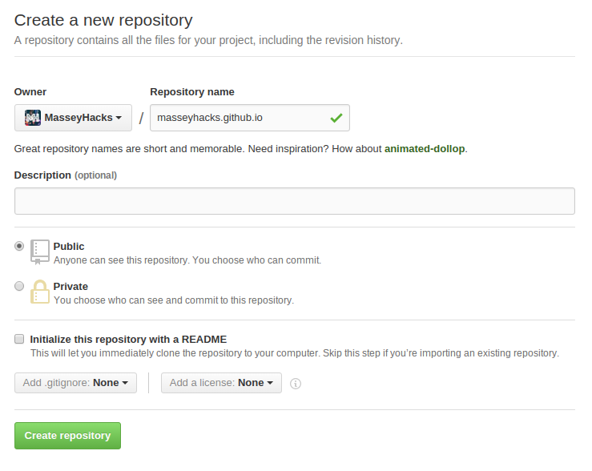</p>

Create the repository and set everything up locally on your computer.

## Section 2: Hello World!

Websites are just a directory: a collection of folders and files. For example, when you access `www.example.com/folder/file.html`, `example.com` is usually marked as a directory on a computer somewhere, where `folder` is a folder in that directory, and `file.html` is a file within `folder`. When a web browser accesses just `example.com`, the web browser actually accesses (usually) `example.com/index.html`: a file named `index.html` within the `example.com` directory. Let's make one of those now.

### Your First `index.html`

Within the directory that you set aside for your repo, create a file called `index.html`. All HTML files follow the same format:

```html
<!DOCTYPE html>
<html>
    <head>
    </head>
    <body>
    </body>
    <!-- this is a comment -->
</html>
```

Go ahead and throw these lines within `index.html`.

HTML stans for HyperText Markup Language. A markup language revolves around things called tags. The tags within thie file are `<html>`, `<head>`, and `<body>`. A tag sometimes begins with a beginning tag, for example `<html>`, and ends with a terminating tag that has a slash in front of the name of the tag, here `</html>`. Sometimes, however, the tag doesn't need to be terminated, for example, the `<!DOCTYPE html>` tag.

Markup languages use tags in order to identify words for some purpose. All of the text between `<tag>` and `</tag>` are marked for some specific purpose. Here are the purposes of the tags that are introduced in our `index.html`:
 - `<html>`: The root tag. A web browser will search for an `<html>` tag, since all other tags will be inside it.
 - `<head>`: Where metadata, information on the HTML document, is placed, for example, the title of the HTML document. `<head>` is usually the first tag within `<html>`.
 - `<body>`: The main content area within an HTML document. It should start immediately after the `</head>` tag and end right before the `</html>` tag. Things shown to the user are usually within `<body>`.
 - `<!DOCTYPE html>`: Just a header to tell everyone that this is an HTML document.

One last thing: comments in HTML start with `<!--` and end with `-->`. Any text captured within comment tags will not be interpreted and rendered into the web page.

Let's get something viewable. Throw in something inbetween the `<body>` tags to show to the user.

```html
<body>
    Hello World!
</body>
```

**Your final HTML document should look like this:**

```html
<!DOCTYPE html>
<html>
    <head>
    </head>
    <body>
    	Hello World!
    </body>
</html>
```

Commit and push the repository to GitHub. Now, visit `<username>.github.io`.

<p align="center">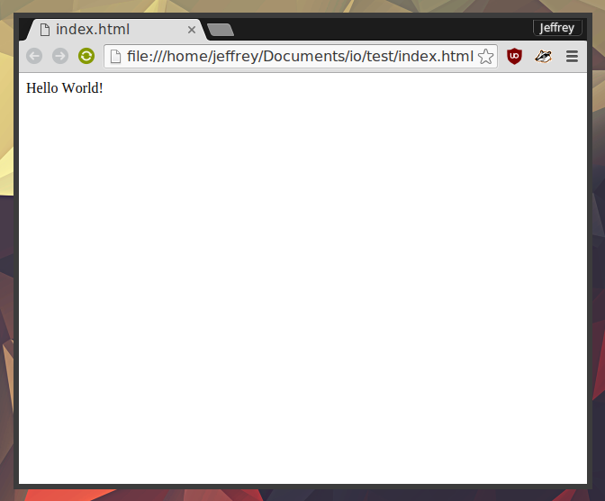</p>

Congratulations! Your website is up and running on GitHub pages, and that `Hello World!` available for everyone in the world to see. If you don't want to wait for `github.io` to process your new website, you can quickly open up `index.html` with your web browser and it will show you exactly the same thing.

## Section 3: Fleshing it Out

Though it might be your first website, right now it's way too ugly to be presentable. Let's start adding some more things!

### Images with the `` tag

Got an image of yourself? Create a folder named `img` within the website directory and throw the image within there. I called my image `avatar.png`. That's right, put stuff next to `index.html`:

<p align="center">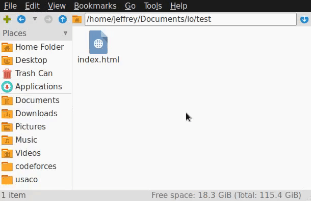</p>

Now, over in `index.html`, add an `` tag into the `<body>` tag.

```html
<body>
    </img>	<!--img tag added to this line-->
    Hello World!
</body>
```

An `` tag, as the name suggests, is a markup tag to identify an image. However, instead of having text within `img`, the source of the image is given as an attribute in the tag. `src` is the name of that attribute. `img/avatar.jpg` is the link to the image, relative to `index.html`. 

Quick note: the `src` attribute can also take a URL, for example, an imgur link. It can also take many image formats as an argument, from .jpg to animated .gif. If you have some time, set [this online .gif](https://i.imgur.com/iu2bXuh.gif) as your `src` for your `img` tag to see it in action. But I digress. 

Do the usual: commit and push. Take a look at the website now. It might look like this...

<p align="center">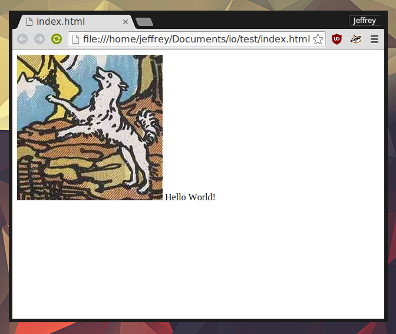</p>

...Or, the web browser might have some issues with this HTML document and spit out this:

<p align="center">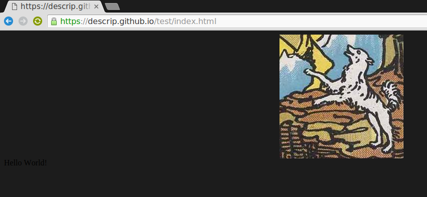</p>

Something's wrong here, huh? Here's how to fix it:

### Paragraphs with the `<p>` tag

Let's take a look at our current body:

```html
<body>
    </img>
    Hello World!
</body>
```

The `Hello World!` is the real problem here. Text shouldn't be put directly into `<body>`. Instead, there is a special tag for them: `<p>`, or paragraph. Everything within `<p>` tags will be consigned to a single paragraph, and there will be a spacing between paragraphs.

To illustrate this, let's add a couple of `<p>` tags. Try out the following `<body>`:

```html
<body>
    </img>
    <p>Hello World!</p>	<!--surround text with p tags-->
</body>
```

The HTML document will now render like this:

<p align="center"></p>

`Hello World` is now on it's own separate line, since it is now its own paragraph. This is how text within the body should be kept, in `<p>` tags.

You can also place the image within the same paragraph as the `Hello World!` text. The following `<body>`...

```html
<body>
    <p></img>
    Hello World!</p>	<!--surround text with p tags-->
</body>
```

...Renders this on your web browser:

<p align="center"></p>

### Headers with the `<h1>` tag

The `<h1>` tag is what's called a header tag. Any of the text within the `<h1>` markup tags will be bolded, and its font size will be increased. The reason why there is a `1` in `h1` is because there are multiple levels of header tags:

<p align="center">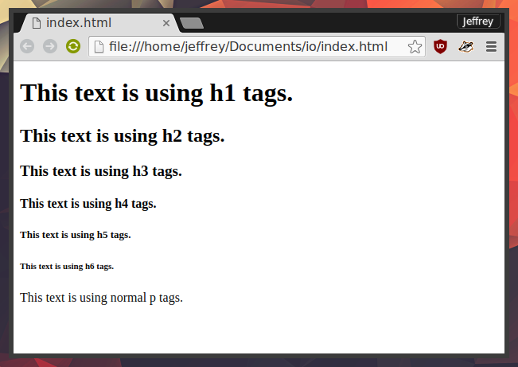</p>

As the number within `<hX>` increases, the size and impact of the header decreases. The header tags start from `<h1>` and end at `<h6>`. 

Let's remove that `<p>` tag, because who has `Hello World!` on a portfolio website? The largest text on your website should be your name, right? Let's do that right now, with an `<h1>` tag. Remove the `<p>` tag within your body, and add your name within the `<body>` surrounded by `<h1>` and `</h1>`. Then, add some extra information as a slightly smaller header. Put a description of who you are and what you do as `<h3>` within your body. For example, here is my current body:

```html
<body>
    </img>
    <h1>Jeffrey Zhao</h1>	<!-- added name as h1-->
    <h3>Student, Pirate, Dog</h3>	<!-- added description as h3 -->
</body>
```

Here is how my HTML document renders:

<p align="center">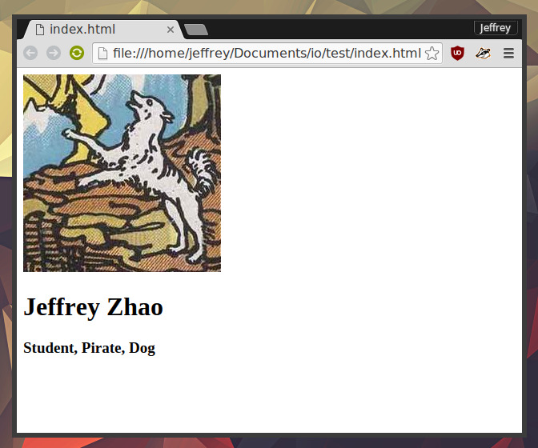</p>

### Links with the `<a>` tag

Usually, a web page serves as a Sectionping stone to other web pages. Clicking on a link will take you somewhere else in the Internet. Links are added to HTML documents using the `<a>` tag.

As a demonstration, let's add some links that lead to places that are important to you. Add a link to your GitHub profile onto your website by editing your `<body>`, like so:

```html
<body>
    </img>
    <h1>Jeffrey Zhao</h1>
    <h3>Student, Pirate, Dog</h3>
    <a href="https://github.com/<username>">GitHub</a>		<!-- Added link to GitHub profile -->
</body>
```

This body will now render the following HTML document:

<p align="center">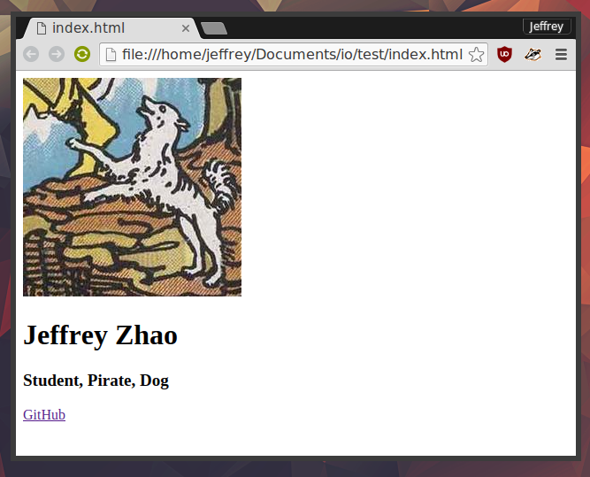</p>

There's now the iconic blue/purple HTML link at the bottom of your portfolio website. If you click on it, you'll end up at your GitHub portfolio!

Examining the `<a>` tag, there are several things to notice. Like images, they taking in an attribute `href`, the location that they will link to. However, they can also take in text within the markup tags, and that text will become the name of the link. Here, `href="https://github.com/<username>">` made this `<a>` tag link to your GitHub profile, and the text within it, `GitHub`, gave the link its name.

The `href` attribute doesn't just accept URLs. For example, you can link another HTML file in the same directory by having the tag be `<a href="<filename>.html">`. Create a file called `about.html` in the same directory `index.html` and make it according to the rules stated earlier in this workshop, about your credentials. For example, here's my `about.html`:

```html
<!DOCTYPE html>
<html>
    <head>
    </head>
    <body>
	<p>Bachelor's Degree from Dog College</p>
	<p>Four Years of Experience as Front-End Pirate</p>
    </body>
</html>
```

Afterwards, add `<a href="about.html">About Me</a>` to your body, on a line under the GitHub profile link. Your `About Me` link will show up next to the GitHub profile one, and, when you click on it, you'll be directed to the `about.html`!

The `href` attribute isn't limited to just HTML documents. Say if you wanted to upload a resume to your website. Create a folder called `res` in the same directory as `index.html` and plop the resume in there. Say that the resume is named `resume.pdf`. You can create a link to the resume with `<a href="res/resume.pdf">Resume</a>`. By placing that under your `About Me` link, your `Resume` link will be the third one on that line.

Here is my final `<body>` for `index.html`:

```html
<body>
	</img>
	<h1>Jeffrey Zhao</h1>
	<h3>Student, Pirate, Dog</h3>
    	<a href="https://github.com/descrip">GitHub</a> | 
	<a href="about.html">About Me</a> | 
	<a href="res/resume.pdf">Resume</a>
</body>
```

You should notice that I've added a ` | ` between each link. It's just a separator.

Here's a gif showing the three links in action:

<p align="center"></p>

### Combining Tags

Tags can usually used in tandem. For example, say I wanted to link to my Twitter account. Let's add it with an image link: an image that, when clicked on, acts as a link and directs to a certain page, in this case my Twitter account.

First, let's search for a good Twitter icon to act as my image link. 

<p align="center">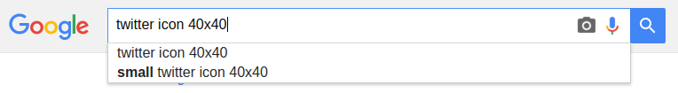</p>

Save the image into the `img` folder, and add it into the body using an `` tag. However, this time, surround the `` tag by an outer `<a>` tag, that links to your Twitter profile.

For example, I would append these three lines to the end of my body.

```html
<a href="https://twitter.com/<username>">	<!-- added image link -->
	</img>
</a>
```

Examine the new addition. The twitter icon is added into the HTML document through `</img>`. The surrounding `<a href="https://twitter.com/<username>">` turns that image into a linkable object, and clicking on the Twitter icon will lead you to the URL that you linked.

<p align="center">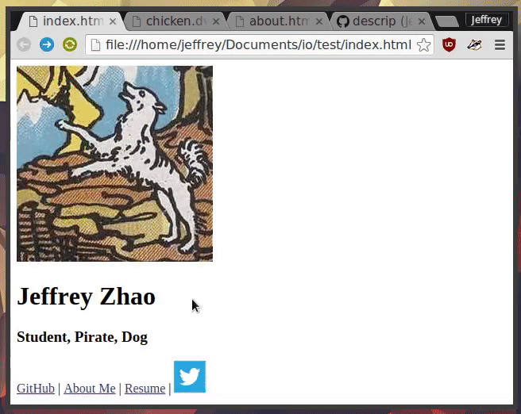</p>

Here is my final body:

```html
<body>
    </img>
    <h1>Jeffrey Zhao</h1>
    <h3>Student, Pirate, Dog</h3>
    <a href="https://github.com/descrip">GitHub</a> | 
	<a href="about.html">About Me</a> | 
	<a href="res/resume.pdf">Resume</a>
	<p>
		<a href="https://plus.google.com/+LinusTorvalds/posts">
			</img>
		</a>
		<a href="https://www.facebook.com/events/1673647522918268/">
			</img>
		</a>
		<a href="https://twitter.com/realDonaldTrump">
			</img>
		</a>
	</p>
</body>
```

I've since added a `<p>` around the Twitter icon link to keep it to its own line, since the height of the icon screws up the rest of the text links. I've also added image link icons to both Google Plus and Facebook profiles. All of them are definitely mine.

Add, commit, push, and marvel at how your website looks on GitHub Pages.

## Section 4: Stylish CSS

Here is the point where we introduce the second language: CSS. CSS stands for Cascading Style Sheets, and is used to change the properties of HTML objects (and usually to make them look better).

There are so many features of CSS that this tutorial will barely stratch its surface. For now, let's start with some basics.

### Creating a CSS File

Within your directory, next to `index.html`, create a file called `style.css`. This file will contain the CSS that affects `index.html`, so `index.html` has to tell the web browser that there is a CSS file to apply when rendering the HTML document. The way that web developers denote a CSS file along with an HTML document lies within its metadata, which means that you'll have to add a line to the `<head>` tags:

```html
<head>
	<link rel="stylesheet" href="style.css">
</head>
```

Don't focus too much on this `link` tag for now, just know that its `href` attribute should list the source of the CSS file, and that its `rel` attribute identifies it as such.

If you reload the website now, you'll see that there hasn't been much change. That's because we don't have anything in the CSS file! Let's add something.

### Learning CSS by Centering Objects

Within the CSS file, throw the following code inside:

```css
body{
	text-align: center;
}
```

If you refresh the page now, you'll see something surprising: all of the HTML elements have centered themselves!

<p align="center">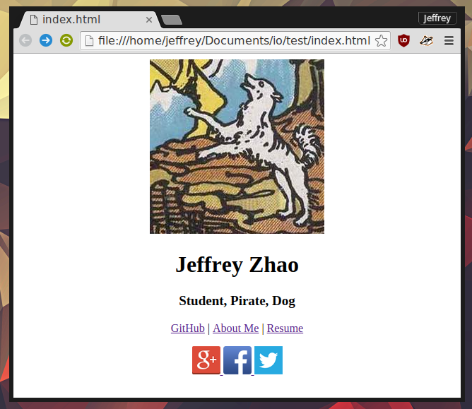</p>

Let's dissect what these lines actually do. CSS comprises of multiple style rules -- in this case, one. Style rules are in the general form of:

```css
selector{
	property1: value1;
	property2: value2;
	property3: value3;
}
```

Here is what each component does:

 - **Selector:** The HTML tag at which a rule will be applied. Here, the selector is `body`.
 - **Property:** An attribute of an HTML tag that will be changed. Here, the property is `text-align`.
 - **Value**: What to change the property of the selector to. Here, the value is `center`.

Though we didn't really encounter them, each HTML object has a number of attributes that have a set value that determines how the object will act. CSS exists to work alongside HTML in order to change the behaviour of its objects to whatever value is specified. Here, `text-align` is a property of every `body` tag, and this CSS rule sets the value of `text-align` to center.

Each CSS rule applies to all HTML tags to the HTML document. This means that every single `<body>` tag will have its `text-align` attribute set to `center`. CSS rules can have multiple property and value pairs, which means that I can set more attributes of `body` by adding more properties within the curly braces.

If we read the CSS that I just gave you in simple English, it would probably sound like "Select every `body` tag on this HTML page and set the alignment of the text within the body tag to be centered."

### Final Touches

Every HTML tag has some attributes that can be altered by CSS, and they can usually be found by simply searching online what you'd like to do with an HTML object. Don't feel pressured to add your CSS rules the exact same way that I do it. Feel free to fiddle with the values within your CSS rules and change them how you'd wish. 

How do I know which HTML objects and attributes to edit? What do I do to get something to behave a certain way? [That's a very good question.](README.md#google-and-stackoverflow-google-and-stackoverflow-google-and-stackoverflow)

I've appended the following CSS rules to my `style.css`:

```css
/* comments in css are within these star slashes */

h1{	/*applied to all h1 tags:*/
	font-family: sans-serif;	/*set font to a sanserif one*/
	margin: 5px;	/*make the margin aroumd h1 objects 5 pixels wide*/
}

h3{	/*applied to all h3 tags:*/
	margin: 5px;	/*make the margin aroumd h3 objects 5 pixels wide*/
}

a{	/*applied to all a tags:*/
	text-decoration: none;		/*normally, text-decoration: underline. setting it to none remoes it.*/
}
```

Each CSS rule changes small properties of my portfolio website, slowly bringing it to this final portfolio:

<p align="center">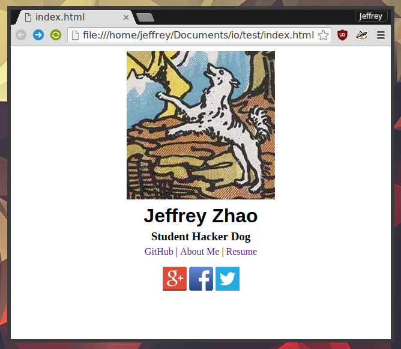</p>

Add, commit, push. Visit `<username>.github.io`. How does your portfolio look?

## Section 5: Final and Future Thoughts

:tada:

Congratulations! You've reached the end of the tutorial, for the most part. Though it is pretty barebones by today's standards, that portfolio is a great first step into the world of web development. Section 5 will now list some things that will help you make more steps!

### Google and StackOverflow! Google and StackOverflow! Google and StackOverflow!

Seriously. These two websites are a programmer's best friend. [StackOverflow](https://stackoverflow.com/) is basically Yahoo! Answers, but for professional programmers in all areas, including web development. If you don't know what Google is, I'm not sure what to say. If you don't know how to do something with HTML or CSS, just consult the search engine, and click on StackOverflow links often.

You've probably asked questions like these hundreds of times within the tutorial:
 - How do I make lists in HTML?
 - How do I know the names of the attributes to edit with CSS?
 - How do I make web applications?

For example, say I wanted to set a background image behind my portfolio. How do I do that? Which HTML object and which property do I edit? Who knows? 

Google does.

<p align="center">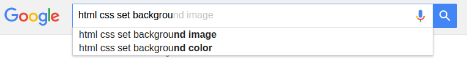</p>

### Inspect Element

One of the ways to really speed up your web development is using your web browser's inspect element feature. You might have opened it up on accident before: a dialog box that starts listing a bunch of HTML and CSS. Usually, the inspect element feature of your browser allows you to make temporary edits to the HTML and CSS of the website that is being inspected, which allows to see your changes occur in real time.

<p align="center"></p>

### Jekyll with GitHub Pages

Don't want to trouble yourself with creating an enitre website from scratch? Would you like to start with a basic foundation? GitHub Pages works very well with [Jekyll](https://jekyllrb.com/), a static page generator that turns your Markdown into HTML documents for you. [Read the guide here](https://help.github.com/articles/using-jekyll-as-a-static-site-generator-with-github-pages/).

### Further Education

Web development is an entire industry and career, and there is no way that I'd be able to teach you everything there is to know about it in an hour. Many people hone their skills in web development through independent study, as there are so many amazing guides on the Internet to follow. 

HTML and CSS are two of the three crucial languages to web development. The third is [JavaScript](https://www.javascript.com/), which isn't really necessary for a basic portfolio website like the one you've just made. However, if you're interested in making a website that has a lot more functionality, I'd definitely recommend learning how to do it.

Here are some I'd recommend:

 - HTMLDog Guides for [HTML](http://www.htmldog.com/guides/html/), [CSS](http://www.htmldog.com/guides/css/), and [JavaScript](http://www.htmldog.com/guides/javascript/) are very concise beginner focused texts.
 - If you're the type of person who sits back and watches educational videos, check out [TreeHouse](https://teamtreehouse.com/library/html#introduction).
 - Though I haven't tried them, there are full interactive courses being offered at [SnoopCode](http://www.snoopcode.com/) and [CodeAcademy](https://www.codecademy.com/learn/web).
