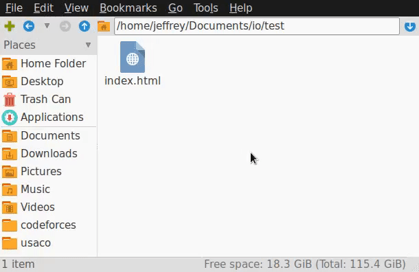

# Building a Website with GitHub Pages

## Websites on GitHub?!

Yup. For each GitHub account, you'll be able to host a website at `<username>.github.io` for free, as long as you're willing to share the code within that website as a GitHub repo (or, if you're not comfortable with that, buy a private repo for your website). Each organisation and project can also get a place on `github.io`. This service is called GitHub Pages.

This workshop will focus on two things. First, it will teach you how to make a simple website out of HTML/CSS. Secondly, it will teach you how to host that website on GitHub. This workshop is not intended to be a through guide to both, and is targeted to people who have little to no experience at both.

You'll finish with a simple portfolio website stating who you are and what you do. [Here's a peek at the finished product.](https://descrip.github.io/finish/index.html)

## Step 0: Prerequisites
1. You're going to need to know how to use git with GitHub. I'd recommend going through our [Git and GitHub Tutorial](git-and-github) by attending the workshop during the hackathon! The rest of these prerequisites is just a copy of the things you need for that workshop.
2. You're going to need a GitHub account. Register one by pressing the big green "Sign Up" on the top right. 
3. Get yourself a copy of git on your computer. You've got two choices:
	- Regular Git: Requires knowledge of the command line. If you're comfortable with a terminal, we'd definitely recommend this one. If you've got a package manager, you're welcome to get git from there.
		- [Download Git for Windows](https://git-for-windows.github.io/)
		- [Download Git for OSX](https://code.google.com/archive/p/git-osx-installer/downloads)
		- [Download Git for Linux](https://git-scm.com/book/en/v2/Getting-Started-Installing-Git)
	- GitHub Desktop: A friendly GUI version for those who don't know how to use a command line.
		- [Download GitHub Desktop for Windows/OSX](https://desktop.github.com/)
		- Linux not supported, sorry. If you're a Linux user, chances are you're downloading regular command line git right now.

## Step 1: Creating the Repository

GitHub Pages operates out of a GitHub repository. Go to the new repository creation screen and create a repository called `<username>.github.io`, where `<username>` is your GitHub username. It is important that you name the repo in this EXACT format, or GitHub will not identify it for GitHub Pages.

<p align="center"></p>

Create the repository and set everything up locally on your computer.

## Step 2: Hello World!

Websites are just a directory: a collection of folders and files. For example, when you access `www.example.com/folder/file.html`, `example.com` is usually marked as a directory on a computer somewhere, where `folder` is a folder in that directory, and `file.html` is a file within `folder`. When a web browser accesses just `example.com`, the web browser actually accesses (usually) `example.com/index.html`: a file named `index.html` within the `example.com` directory. Let's make one of those now.

### Your First `index.html`

Within the directory that you set aside for your repo, create a file called `index.html`. All HTML files follow the same format:

```html
<!DOCTYPE html>
<html>
    <head>
    </head>
    <body>
    </body>
    <!-- this is a comment -->
</html>
```

Go ahead and throw these lines within `index.html`.

HTML stans for HyperText Markup Language. A markup language revolves around things called tags. The tags within thie file are `<html>`, `<head>`, and `<body>`. A tag sometimes begins with a beginning tag, for example `<html>`, and ends with a terminating tag that has a slash in front of the name of the tag, here `</html>`. Sometimes, however, the tag doesn't need to be terminated, for example, the `<!DOCTYPE html>` tag.

Markup languages use tags in order to identify words for some purpose. All of the text between `<tag>` and `</tag>` are marked for some specific purpose. Here are the purposes of the tags that are introduced in our `index.html`:
 - `<html>`: The root tag. A web browser will search for an `<html>` tag, since all other tags will be inside it.
 - `<head>`: Where metadata, information on the HTML document, is placed, for example, the title of the HTML document. `<head>` is usually the first tag within `<html>`.
 - `<body>`: The main content area within an HTML document. It should start immediately after the `</head>` tag and end right before the `</html>` tag. Things shown to the user are usually within `<body>`.
 - `<!DOCTYPE html>`: Just a header to tell everyone that this is an HTML document.

One last thing: comments in HTML start with `<!--` and end with `-->`. Any text captured within comment tags will not be interpreted and rendered into the web page.

Let's get something viewable. Throw in something inbetween the `<body>` tags to show to the user.

```html
    <body>
    	Hello World!
    </body>
```

**Your final HTML document should look like this:**

```html
<!DOCTYPE html>
<html>
    <head>
    </head>
    <body>
    	Hello World!
    </body>
</html>
```

Commit and push the repository to GitHub. Now, visit `<username>.github.io`.

<p align="center"></p>

Congratulations! Your website is up and running on GitHub pages, and that `Hello World!` available for everyone in the world to see. If you don't want to wait for `github.io` to process your new website, you can quickly open up `index.html` with your web browser and it will show you exactly the same thing.

## Step 3: Fleshing it Out

Though it might be your first website, right now it's way too ugly to be presentable. Let's start adding some more things!

### Images with the `` tag

Got an image of yourself? Create a folder named `img` within the website directory and throw the image within there. I called my image `avatar.png`. That's right, put stuff next to `index.html`:

<p align="center"></p>

Now, over in `index.html`, add an `` tag into the `<body>` tag.

```html
    <body>
    	</img>	<!--img tag added to this line-->
    	Hello World!
    </body>
```

An `` tag, as the name suggests, is a markup tag to identify an image. However, instead of having text within `img`, the source of the image is given as an attribute in the tag. `src` is the name of that attribute. `img/avatar.jpg` is the link to the image, relative to `index.html`. 

Quick note: the `src` attribute can also take a URL, for example, an imgur link. It can also take many image formats as an argument, from .jpg to animated .gif. If you have some time, set [this online .gif](https://i.imgur.com/iu2bXuh.gif) as your `src` for your `img` tag to see it in action. But I digress. 

**Your final HTML document should look like this:**

```html
<!DOCTYPE html>
<html>
    <head>
    </head>
    <body>
    	</img>
    	Hello World!
    </body>
</html>
```

Do the usual: commit and push. Take a look at the website now. It might look like this...

<p align="center"></p>

...Or, the web browser might have some issues with this HTML document and spit out this:

<p align="center"></p>

Something's wrong here, huh? Here's how to fix it:

### Paragraphs with the `<p>` tag

Let's take a look at our current body:

```html
    <body>
    	</img>
    	Hello World!
    </body>
```

The `Hello World!` is the real problem here. Text shouldn't be put directly into `<body>`. Instead, there is a special tag for them: `<p>`, or paragraph. Everything within `<p>` tags will be consigned to a single paragraph, and there will be a spacing between paragraphs.

To illustrate this, let's add a couple of `<p>` tags. Try out the following `<body>`:

```html
    <body>
    	</img>
    	<p>Hello World!</p>	<!--surround text with p tags-->
    </body>
```

The HTML document will now render like this:

<p align="center"></p>


TODO: Add more to `<p>`

### Headers with the `<h1>` tag


[//]: # (DO NOT TOUCH the below table. Jeffrey)

<table>
	<tr>
		<td>
			<div class="highlight highlight-text-html-basic">
				<pre>
&lt;<span class="pl-ent" >body</span>&gt;
    &lt;<span class="pl-ent" >img</span> src="img/avatar.jpg"&gt;&lt;/img&gt;
    &lt;<span class="pl-ent" >p</span>&gt;Hello World!&lt;/<span class="pl-ent" >p</span>&gt;
&lt;/<span class="pl-ent" >body</span>&gt;
				</pre>
			</div>
		</td>
		<td>
		</td>
	</tr>
	<tr>
		<td>
			<div class="highlight highlight-text-html-basic">
				<pre>
&lt;<span class="pl-ent" >body</span>&gt;
    &lt;<span class="pl-ent" >img</span> src="img/avatar.jpg"&gt;&lt;/img&gt;
    &lt;<span class="pl-ent" >p</span>&gt;Hello&lt;/<span class="pl-ent" >p</span>&gt; &lt;<span class="pl-ent" >p</span>&gt;World!&lt;/<span class="pl-ent" >p</span>&gt;
&lt;/<span class="pl-ent" >body</span>&gt;
				</pre>
			</div>
		</td>
		<td>
		</td>
	</tr>
</table>
